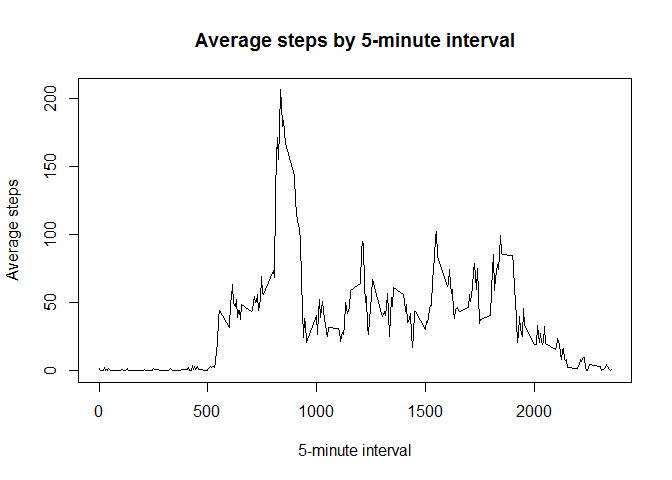

## Loading and preprocessing the data


```r
data <- read.csv("activity/activity.csv", header = T)
summary(data)
```

```
##      steps                date          interval     
##  Min.   :  0.00   2012-10-01:  288   Min.   :   0.0  
##  1st Qu.:  0.00   2012-10-02:  288   1st Qu.: 588.8  
##  Median :  0.00   2012-10-03:  288   Median :1177.5  
##  Mean   : 37.38   2012-10-04:  288   Mean   :1177.5  
##  3rd Qu.: 12.00   2012-10-05:  288   3rd Qu.:1766.2  
##  Max.   :806.00   2012-10-06:  288   Max.   :2355.0  
##  NA's   :2304     (Other)   :15840
```

```r
str(data)
```

```
## 'data.frame':	17568 obs. of  3 variables:
##  $ steps   : int  NA NA NA NA NA NA NA NA NA NA ...
##  $ date    : Factor w/ 61 levels "2012-10-01","2012-10-02",..: 1 1 1 1 1 1 1 1 1 1 ...
##  $ interval: int  0 5 10 15 20 25 30 35 40 45 ...
```

```r
head(data)
```

```
##   steps       date interval
## 1    NA 2012-10-01        0
## 2    NA 2012-10-01        5
## 3    NA 2012-10-01       10
## 4    NA 2012-10-01       15
## 5    NA 2012-10-01       20
## 6    NA 2012-10-01       25
```

## What is mean total number of steps taken per day?

1. Calculate the total number of steps taken per day


```r
total.steps.by.date <- aggregate(data[,'steps'], by = list(data$date), FUN = sum)
colnames(total.steps.by.date) <- c("date", "steps")
summary(total.steps.by.date)
```

```
##          date        steps      
##  2012-10-01: 1   Min.   :   41  
##  2012-10-02: 1   1st Qu.: 8841  
##  2012-10-03: 1   Median :10765  
##  2012-10-04: 1   Mean   :10766  
##  2012-10-05: 1   3rd Qu.:13294  
##  2012-10-06: 1   Max.   :21194  
##  (Other)   :55   NA's   :8
```

```r
str(total.steps.by.date)
```

```
## 'data.frame':	61 obs. of  2 variables:
##  $ date : Factor w/ 61 levels "2012-10-01","2012-10-02",..: 1 2 3 4 5 6 7 8 9 10 ...
##  $ steps: int  NA 126 11352 12116 13294 15420 11015 NA 12811 9900 ...
```

```r
head(total.steps.by.date)
```

```
##         date steps
## 1 2012-10-01    NA
## 2 2012-10-02   126
## 3 2012-10-03 11352
## 4 2012-10-04 12116
## 5 2012-10-05 13294
## 6 2012-10-06 15420
```

2. Make a histogram of the total number of steps taken each day


```r
total.steps.by.date$date <- as.POSIXct(total.steps.by.date$date)
plot(total.steps.by.date$date, total.steps.by.date$steps, type = "h", xlab = "Date", ylab = "Steps", main = "Total steps by date")
```

<!-- -->

3. Calculate and report the mean and median of the total number of steps taken per day


```r
mean(total.steps.by.date$steps, na.rm = T)
```

```
## [1] 10766.19
```

```r
median(total.steps.by.date$steps, na.rm = T)
```

```
## [1] 10765
```

## What is the average daily activity pattern?

1. Make a time series plot (i.e. type = "l") of the 5-minute interval (x-axis) and the average number of steps taken, averaged across all days (y-axis)


```r
avg.steps.by.interval <- aggregate(data[,'steps'], by = list(data$interval), FUN = mean, na.rm = T)
colnames(avg.steps.by.interval) <- c("interval", "steps")
summary(avg.steps.by.interval)
```

```
##     interval          steps        
##  Min.   :   0.0   Min.   :  0.000  
##  1st Qu.: 588.8   1st Qu.:  2.486  
##  Median :1177.5   Median : 34.113  
##  Mean   :1177.5   Mean   : 37.383  
##  3rd Qu.:1766.2   3rd Qu.: 52.835  
##  Max.   :2355.0   Max.   :206.170
```

```r
str(avg.steps.by.interval)
```

```
## 'data.frame':	288 obs. of  2 variables:
##  $ interval: int  0 5 10 15 20 25 30 35 40 45 ...
##  $ steps   : num  1.717 0.3396 0.1321 0.1509 0.0755 ...
```

```r
head(avg.steps.by.interval)
```

```
##   interval     steps
## 1        0 1.7169811
## 2        5 0.3396226
## 3       10 0.1320755
## 4       15 0.1509434
## 5       20 0.0754717
## 6       25 2.0943396
```


```r
plot(avg.steps.by.interval$interval, 
     avg.steps.by.interval$steps, 
     type = "l",
     main = "Average steps by 5-minute interval",
     xlab = "5-minute interval", 
     ylab = "Average steps")
```

<!-- -->

2. Which 5-minute interval, on average across all the days in the dataset, contains the maximum number of steps?


```r
filter(avg.steps.by.interval, steps == max(avg.steps.by.interval$steps))
```

```
##   interval    steps
## 1      835 206.1698
```

## Imputing missing values

1. Calculate and report the total number of missing values in the dataset (i.e. the total number of rows with NAs)


```r
sum(is.na(data$steps))
```

```
## [1] 2304
```

2. Devise a strategy for filling in all of the missing values in the dataset. The strategy does not need to be sophisticated. For example, you could use the mean/median for that day, or the mean for that 5-minute interval, etc.

I decided to fill the missing values with the mean of that 5-minute interval.

3. Create a new dataset that is equal to the original dataset but with the missing data filled in.


```r
data.without.nas <- data
data.without.nas$steps <- ave(data$steps, data$interval, FUN = na.aggregate)
head(data.without.nas)
```

```
##       steps       date interval
## 1 1.7169811 2012-10-01        0
## 2 0.3396226 2012-10-01        5
## 3 0.1320755 2012-10-01       10
## 4 0.1509434 2012-10-01       15
## 5 0.0754717 2012-10-01       20
## 6 2.0943396 2012-10-01       25
```

```r
str(data.without.nas)
```

```
## 'data.frame':	17568 obs. of  3 variables:
##  $ steps   : num  1.717 0.3396 0.1321 0.1509 0.0755 ...
##  $ date    : Factor w/ 61 levels "2012-10-01","2012-10-02",..: 1 1 1 1 1 1 1 1 1 1 ...
##  $ interval: int  0 5 10 15 20 25 30 35 40 45 ...
```

```r
summary(data.without.nas)
```

```
##      steps                date          interval     
##  Min.   :  0.00   2012-10-01:  288   Min.   :   0.0  
##  1st Qu.:  0.00   2012-10-02:  288   1st Qu.: 588.8  
##  Median :  0.00   2012-10-03:  288   Median :1177.5  
##  Mean   : 37.38   2012-10-04:  288   Mean   :1177.5  
##  3rd Qu.: 27.00   2012-10-05:  288   3rd Qu.:1766.2  
##  Max.   :806.00   2012-10-06:  288   Max.   :2355.0  
##                   (Other)   :15840
```

4. Make a histogram of the total number of steps taken each day and Calculate and report the mean and median total number of steps taken per day. Do these values differ from the estimates from the first part of the assignment? What is the impact of imputing missing data on the estimates of the total daily number of steps?


```r
total.steps.by.date.withous.nas <- aggregate(data.without.nas[,'steps'], by = list(data.without.nas$date), FUN = sum)
colnames(total.steps.by.date.withous.nas) <- c("date", "steps")
summary(total.steps.by.date.withous.nas)
```

```
##          date        steps      
##  2012-10-01: 1   Min.   :   41  
##  2012-10-02: 1   1st Qu.: 9819  
##  2012-10-03: 1   Median :10766  
##  2012-10-04: 1   Mean   :10766  
##  2012-10-05: 1   3rd Qu.:12811  
##  2012-10-06: 1   Max.   :21194  
##  (Other)   :55
```

```r
str(total.steps.by.date.withous.nas)
```

```
## 'data.frame':	61 obs. of  2 variables:
##  $ date : Factor w/ 61 levels "2012-10-01","2012-10-02",..: 1 2 3 4 5 6 7 8 9 10 ...
##  $ steps: num  10766 126 11352 12116 13294 ...
```

```r
head(total.steps.by.date.withous.nas)
```

```
##         date    steps
## 1 2012-10-01 10766.19
## 2 2012-10-02   126.00
## 3 2012-10-03 11352.00
## 4 2012-10-04 12116.00
## 5 2012-10-05 13294.00
## 6 2012-10-06 15420.00
```

```r
total.steps.by.date.withous.nas$date <- as.POSIXct(total.steps.by.date.withous.nas$date)
plot(total.steps.by.date.withous.nas$date, total.steps.by.date.withous.nas$steps, type = "h", xlab = "Date", ylab = "Steps", main = "Total steps by date")
```

<!-- -->

```r
mean(total.steps.by.date.withous.nas$steps, na.rm = T)
```

```
## [1] 10766.19
```

```r
median(total.steps.by.date.withous.nas$steps, na.rm = T)
```

```
## [1] 10766.19
```

There is no difference in mean since the missing values were filled with the mean of the interval. The median however is a bit different. In fact the value of median is the same as the value of mean. One could say that imputing missing data does not have a big impact. 

# Are there differences in activity patterns between weekdays and weekends?

1. Create a new factor variable in the dataset with two levels - "weekday" and "weekend" indicating whether a given date is a weekday or weekend day.


```r
data.without.nas$date <- as.POSIXct(data.without.nas$date)
wdays <- c('Monday', 'Tuesday', 'Wednesday', 'Thursday', 'Friday')
data.without.nas$weekday <- factor((weekdays(data.without.nas$date) %in% wdays), levels=c(FALSE, TRUE),labels=c('weekend', 'weekday'))
```

2. Make a panel plot containing a time series plot (i.e. type = "l") of the 5-minute interval (x-axis) and the average number of steps taken, averaged across all weekday days or weekend days (y-axis).


```r
mean.of.steps.by.interval.and.weekday <- aggregate(steps ~ interval + weekday, data = data.without.nas, mean)
names(mean.of.steps.by.interval.and.weekday) <- c("interval", "weekday", "steps")
ggplot(data = mean.of.steps.by.interval.and.weekday, aes(x = interval, y = steps)) + facet_grid(weekday~.) + geom_line(colour = "blue") + xlab("Interval") + ylab("Number of steps")
```

<!-- -->
